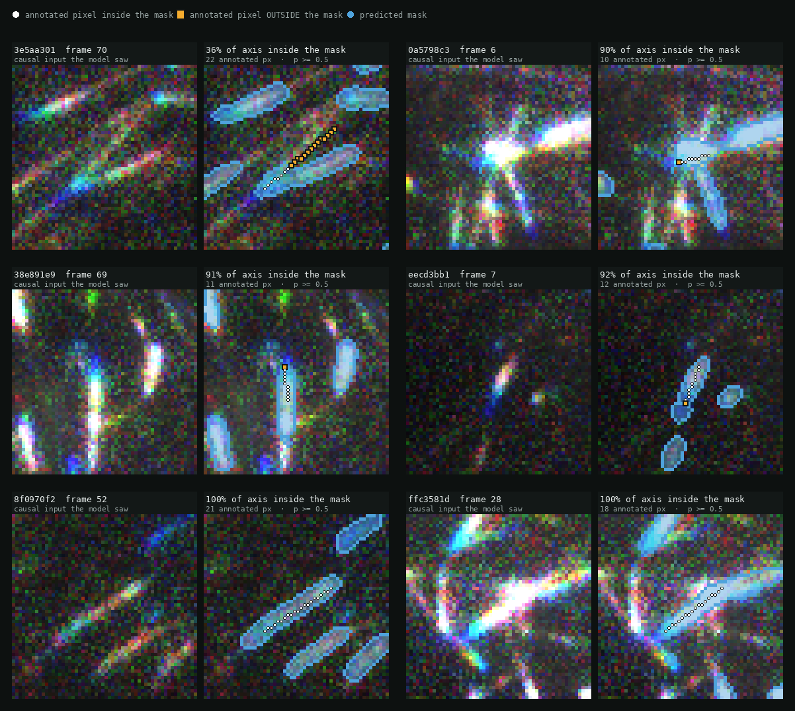

# EB3 comet detection and tracking

Two halves of one pipeline for measuring microtubule plus-end dynamics from
live-cell TIRF movies of EB3-GFP.

| | what it is |
|---|---|
| [`SAM3Training/`](SAM3Training/) | the **detector** — a fine-tuned SAM3 query model that emits, per comet: presence, a centreline axis mask, a head heatmap, and a frame-to-frame identity link |
| [`CometTracker_v7/`](CometTracker_v7/) | the **tracker** — a plusTipTracker-shaped two-stage LAP tracker that links those masks into growth / pause / shrinkage tracks |

They are independent. The tracker reads a `<stem>_labels.tif` +
`<stem>_prob.tif` prediction folder, which is the same layout the project's
ilastik and U-Net detectors produce, so any of the three can drive it.

---

### Does the predicted mask cover the annotated axis?



Validation examples. Each pair is the **causal RGB input the model actually saw**
(`R = I(t-2), G = I(t-1), B = I(t)` — the colour fringing *is* the motion) beside
the **predicted axis mask** at `p >= 0.5`, with the hand-annotated axis drawn on
top: white where an annotated pixel falls inside the mask, orange where it falls
outside.

This is the property the tracker depends on. V7 takes a comet's direction from
the principal axis of its mask, so what matters is not how much area the mask
gets right but whether it lies along the annotated axis. Most examples here are
90-100%; the 36% case is included rather than cropped out, and it is the
instructive one — the mask has split the comet from its neighbour and kept only
part of the axis, which is exactly the case that produces an unreliable
`sigma_theta` and gets a wider corridor from the gate.

## See it run

[**Watch a movie being tracked**](https://claude.ai/code/artifact/02bb8675-9613-4740-87d2-49a7cb4d425f) — raw TIRF frames beside the same
frames with tracks overlaid. Each track appears when the tracker acquires the
comet, draws the path travelled, and disappears when the comet is lost.

<!-- The page is hosted rather than committed so a clone stays small: the
     rendered mp4s are ~3 MB each and regenerate in about 20 seconds from
     CometTracker_v7/tools/render_video.py. -->

## The tracker in one paragraph

A microtubule grows along a line, and a SAM3 mask is a *rendered centreline*
rather than a blob of light — its training target is a 3 px-wide soft tube with
"deliberately no taper". So the mask's principal axis is the growth axis.
Measured on real predictions: **5.4°** median between the mask axis and the
direction of travel, and the across-axis component of a single-frame step has a
**p99 of 2.16 px**. V7 spends that on a corridor gate that, unlike any
motion-derived gate, already exists on a track's *first* frame.

See [`CometTracker_v7/DESIGN.md`](CometTracker_v7/DESIGN.md) for what is
measured, what is guessed, and what is known to be broken.

```bash
cd CometTracker_v7
pip install -r requirements.txt
python -m pytest tests/ -q          # 47 tests
```

```python
from comet_tracker_v7.pipeline import run_folder
from comet_tracker_v7.config import Config

r = run_folder("path/to/SAM3_Predictions", "<movie stem>", Config())
print(len(r.compounds), "tracks;", r.stats["growth_speed_um_min_mean"], "um/min")
```

---

## Getting the model weights

Neither checkpoint is in this repository, for different reasons.

**The base SAM3 checkpoint** is gated on Hugging Face and is not ours to
redistribute. `SAM3Training/scripts/download_checkpoint.sh` fetches it after you
log in. `configs/campaign.yaml` pins the exact SAM3 commit
(`660a5e9e1b8b4c02c0ad97229b88a09a6e4ff5b7`) the fine-tune was built against —
a different commit is not guaranteed to load.

**The fine-tuned adapters** are 337 MB each, over GitHub's 100 MB per-file
limit, so both are distributed as **release assets** rather than committed.
Both come from the same 25-epoch curriculum campaign and share an architecture;
they differ only in weights.

| file | epoch | md5 | use |
|---|---|---|---|
| `best.pt` | 20 | `7caa227ac413327c122c0488231cafd6` | **the default** — best validation score |
| `epoch_25_adapter.pt` | 25 | `1e360e70f91423451fbeb01ca1734135` | final epoch, published for comparison |

<!-- These URLs resolve once the v0.1.0 release exists; see "Uploading the weights". -->
```bash
mkdir -p SAM3Training/runs/comet_sam3_final
BASE=https://github.com/JoglekarLab/CometTracker/releases/download/v0.1.0
curl -L -o SAM3Training/runs/comet_sam3_final/best.pt              $BASE/best.pt
curl -L -o SAM3Training/runs/comet_sam3_final/epoch_25_adapter.pt  $BASE/epoch_25_adapter.pt
md5sum SAM3Training/runs/comet_sam3_final/*.pt   # check against the table above
```

Point the export at whichever you want with `ADAPTER=`. The run's `last.pt` is
about 1 GB because it carries optimizer state for resuming training; it is not
needed for inference and is deliberately not published.

This needs **more than 16 GB of GPU memory**. A pair of 1008×1008 inputs wants
about 6.4 GB in a single allocation without flash attention, so pre-Ampere
V100s die in the first forward pass — see the note at the top of
`sbatch/predict_sam3.sbatch`.

---

## What is not here

Raw `.nd2` movies, evaluation data, model checkpoints, and the vendored u-track
MATLAB source all stay out — about 6.7 GB, and the u-track copy is GPL. The
`.gitignore` is an allow-list rather than a deny-list so none of it can be added
by accident.

The training manifests in `SAM3Training/training_data/manifests/` are recipes
holding relative provenance paths, not image data. They are the reproducibility
audit trail; they need the original movies to be resolvable.

### Uploading the weights (maintainers)

```bash
gh release create v0.1.0 \
  SAM3Training/runs/comet_sam3_final/best.pt \
  SAM3Training/runs/comet_sam3_final/epoch_25_adapter.pt \
  --title "comet-SAM3 v0.1.0" \
  --notes "Fine-tuned SAM3 adapters from the 25-epoch curriculum campaign."
```

Note that a private repository's releases are private too, so anyone who needs
the weights must be a collaborator. If they should reach a wider audience,
Zenodo is the better home: it gives a DOI, needs no access management, and
outlives the repository.

## Credit

The tracking algorithm follows **plusTipTracker** (Applegate et al. 2011,
*J Struct Biol* 176:168–184) and the LAP framework of **u-track** (Jaqaman et
al. 2008, *Nat Methods* 5:695–702). `CometTracker_v7` is an independent
implementation — it was written from scratch and shares no code with either, so
it is not bound by u-track's GPL. It reproduces their *method*: two-stage
assignment, forward/backward gap classification, and MSS motion analysis.
